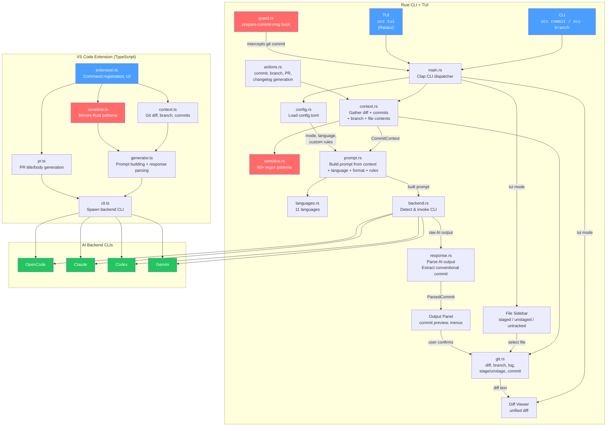

# OpenCodeCommit Architecture

```mermaid
graph TB
    subgraph "Rust CLI + TUI"
        CLI["CLI<br/><code>occ commit / occ branch</code>"]
        TUI["TUI<br/><code>occ tui</code><br/>(Ratatui)"]
        MAIN["main.rs<br/>Clap CLI dispatcher"]
        CFG["config.rs<br/>Load config.toml"]
        GIT["git.rs<br/>diff, branch, log,<br/>stage/unstage, commit"]
        CTX["context.rs<br/>Gather diff + commits<br/>+ branch + file contents"]
        SENS_RS["sensitive.rs<br/>60+ regex patterns"]
        PROMPT["prompt.rs<br/>Build prompt from context<br/>+ language + format + rules"]
        LANG["languages.rs<br/>11 languages"]
        RESP["response.rs<br/>Parse AI output<br/>Extract conventional commit"]
        BACKEND_RS["backend.rs<br/>Detect & invoke CLI"]
        SIDEBAR["File Sidebar<br/>staged / unstaged / untracked"]
        DIFF["Diff Viewer<br/>unified diff"]
        OUTPUT["Output Panel<br/>commit preview, menus"]
        ACTIONS["actions.rs<br/>commit, branch, PR,<br/>changelog generation"]
        GUARD["guard.rs<br/>prepare-commit-msg hook"]
    end

    subgraph "VS Code Extension (TypeScript)"
        EXT["extension.ts<br/>Command registration, UI"]
        EXT_CTX["context.ts<br/>Git diff, branch, commits"]
        EXT_SENS["sensitive.ts<br/>Mirrors Rust patterns"]
        EXT_GEN["generator.ts<br/>Prompt building + response parsing"]
        EXT_CLI["cli.ts<br/>Spawn backend CLI"]
        EXT_PR["pr.ts<br/>PR title/body generation"]
    end

    subgraph "AI Backend CLIs"
        OPENCODE["OpenCode"]
        CLAUDE["Claude"]
        CODEX["Codex"]
        GEMINI["Gemini"]
    end

    %% Rust CLI flow
    CLI --> MAIN
    TUI --> MAIN
    MAIN --> CFG
    MAIN --> CTX
    CTX --> GIT
    CTX --> SENS_RS
    CTX -->|"CommitContext"| PROMPT
    PROMPT --> LANG
    CFG -->|"mode, language,<br/>custom rules"| PROMPT
    PROMPT -->|"built prompt"| BACKEND_RS

    %% Rust backend
    BACKEND_RS --> OPENCODE
    BACKEND_RS --> CLAUDE
    BACKEND_RS --> CODEX
    BACKEND_RS --> GEMINI

    %% Rust response
    BACKEND_RS -->|"raw AI output"| RESP
    RESP -->|"ParsedCommit"| OUTPUT

    %% TUI internals
    MAIN -->|"tui mode"| SIDEBAR
    MAIN -->|"tui mode"| DIFF
    SIDEBAR -->|"select file"| GIT
    GIT -->|"diff text"| DIFF
    ACTIONS --> CTX
    OUTPUT -->|"user confirms"| GIT
    GUARD -->|"intercepts git commit"| MAIN

    %% Extension flow (independent parallel pipeline)
    EXT --> EXT_CTX
    EXT --> EXT_SENS
    EXT_CTX --> EXT_GEN
    EXT_SENS --> EXT_GEN
    EXT_GEN --> EXT_CLI
    EXT --> EXT_PR
    EXT_PR --> EXT_CLI

    %% Extension spawns backend CLIs directly
    EXT_CLI --> OPENCODE
    EXT_CLI --> CLAUDE
    EXT_CLI --> CODEX
    EXT_CLI --> GEMINI

    style CLI fill:#4a9eff,color:#fff
    style TUI fill:#4a9eff,color:#fff
    style EXT fill:#4a9eff,color:#fff
    style SENS_RS fill:#ff6b6b,color:#fff
    style EXT_SENS fill:#ff6b6b,color:#fff
    style GUARD fill:#ff6b6b,color:#fff
    style OPENCODE fill:#22c55e,color:#fff
    style CLAUDE fill:#22c55e,color:#fff
    style CODEX fill:#22c55e,color:#fff
    style GEMINI fill:#22c55e,color:#fff
```
