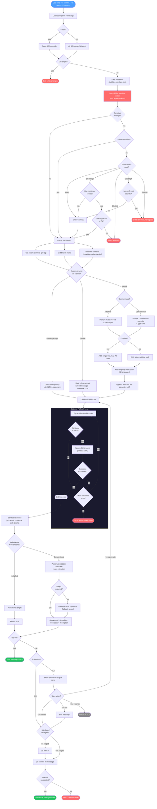

# OpenCodeCommit Process Flow

```mermaid
flowchart TD
    START(["User runs occ commit / TUI action / Extension"])

    %% Phase 1: Config & Input
    START --> LOAD_CFG["Load config.toml + CLI args"]
    LOAD_CFG --> STDIN{"--stdin?"}
    STDIN -->|yes| READ_STDIN["Read diff from stdin"]
    STDIN -->|no| GET_DIFF["git diff (staged/all/auto)"]
    READ_STDIN --> EMPTY{"Diff empty?"}
    GET_DIFF --> EMPTY
    EMPTY -->|yes| ERR_NOCHANGE([Exit 1: No changes])
    EMPTY -->|no| FILTER["Filter noise files<br/>(lockfiles, minified, dist)"]

    %% Phase 2: Sensitive Scanning
    FILTER --> SCAN["Scan diff for sensitive content<br/>(60+ regex patterns)"]
    SCAN --> HAS_SENS{"Sensitive<br/>findings?"}
    HAS_SENS -->|no| GATHER
    HAS_SENS -->|yes| ALLOW_FLAG{"--allow-sensitive?"}
    ALLOW_FLAG -->|yes| GATHER
    ALLOW_FLAG -->|no| ENFORCE{"Enforcement<br/>mode?"}

    ENFORCE -->|Warn| WARN_USER["Show warning"] --> GATHER
    ENFORCE -->|BlockHigh| CHECK_SEV{"Has confirmed<br/>secrets?"}
    ENFORCE -->|BlockAll| BLOCK([Exit 5: Blocked])
    ENFORCE -->|StrictHigh| CHECK_SEV_STRICT{"Has confirmed<br/>secrets?"}
    ENFORCE -->|StrictAll| BLOCK_STRICT([Exit 5: Blocked, no bypass])

    CHECK_SEV -->|no| WARN_USER
    CHECK_SEV -->|yes| TUI_BYPASS{"User bypasses<br/>in TUI?"}
    TUI_BYPASS -->|yes| GATHER
    TUI_BYPASS -->|no| BLOCK

    CHECK_SEV_STRICT -->|no| WARN_USER
    CHECK_SEV_STRICT -->|yes| BLOCK_STRICT

    %% Phase 3: Context Gathering
    GATHER["Gather full context"]
    GATHER --> GET_COMMITS["Get recent commits (git log)"]
    GATHER --> GET_BRANCH["Get branch name"]
    GATHER --> GET_FILES["Read file contents<br/>(smart truncation by size)"]

    %% Phase 4: Prompt Building
    GET_COMMITS --> BUILD_PROMPT
    GET_BRANCH --> BUILD_PROMPT
    GET_FILES --> BUILD_PROMPT

    BUILD_PROMPT{"Custom prompt<br/>or --refine?"}
    BUILD_PROMPT -->|custom prompt| CUSTOM_P["Use custom prompt<br/>with {diff} replacement"]
    BUILD_PROMPT -->|--refine| REFINE_P["Build refine prompt<br/>current message + feedback + diff"]
    BUILD_PROMPT -->|normal| MODE{"Commit mode?"}

    MODE -->|Adaptive| ADAPT["Prompt: match recent commit style"]
    MODE -->|Conventional| CONV["Prompt: conventional commits<br/>+ type rules"]

    ADAPT --> LENGTH
    CONV --> LENGTH
    LENGTH{"Oneliner?"}
    LENGTH -->|yes| ONE["Add: single line, max 72 chars"]
    LENGTH -->|no| MULTI["Add: allow multiline body"]

    ONE --> ADD_LANG["Add language instruction<br/>(11 languages)"]
    MULTI --> ADD_LANG
    CUSTOM_P --> DETECT
    REFINE_P --> DETECT
    ADD_LANG --> APPEND_CONTEXT["Append branch + file contents + diff"]
    APPEND_CONTEXT --> DETECT

    %% Phase 5: Backend Detection & Fallback
    DETECT["Detect backend CLI"]
    DETECT --> FALLBACK_LOOP

    subgraph FALLBACK_LOOP ["Backend Fallback Loop"]
        direction TB
        TRY["Try next backend in order"]
        TRY --> FOUND{"CLI found<br/>in PATH?"}
        FOUND -->|no| MORE{"More backends<br/>to try?"}
        FOUND -->|yes| INVOKE["Spawn CLI process<br/>(timeout 120s)"]
        INVOKE --> EXEC_OK{"Execution<br/>succeeded?"}
        EXEC_OK -->|yes| DONE_LOOP(["Got response"])
        EXEC_OK -->|no| MORE
        MORE -->|yes| TRY
        MORE -->|no| ALL_FAIL([Exit 2: All backends failed])
    end

    %% Phase 6: Response Parsing
    DONE_LOOP --> SANITIZE["Sanitize response<br/>(strip ANSI, preamble, code blocks)"]
    SANITIZE --> PARSE_MODE{"Adaptive or<br/>Conventional?"}

    PARSE_MODE -->|Adaptive| VALIDATE["Validate not empty"]
    PARSE_MODE -->|Conventional| PARSE_CONV["Parse type(scope): message<br/>regex extraction"]
    PARSE_CONV --> MATCHED{"Regex<br/>matched?"}
    MATCHED -->|yes| FORMAT
    MATCHED -->|no| INFER["Infer type from keywords<br/>(fallback: chore)"]
    INFER --> FORMAT

    VALIDATE --> FORMAT_ADAPT["Return as-is"]
    FORMAT["Apply emoji + template +<br/>lowercase + description"]

    %% Phase 7: Output
    FORMAT --> DRY{"--dry-run?"}
    FORMAT_ADAPT --> DRY
    DRY -->|yes| PRINT_ONLY([Print message, exit 0])
    DRY -->|no| TUI_OR_CLI{"TUI or CLI?"}

    TUI_OR_CLI -->|CLI| AUTO_STAGE{"Has staged<br/>changes?"}
    TUI_OR_CLI -->|TUI| SHOW_PREVIEW["Show preview in output panel"]

    SHOW_PREVIEW --> USER_ACTION{"User action?"}
    USER_ACTION -->|"c = commit"| AUTO_STAGE
    USER_ACTION -->|"r = regenerate"| DETECT
    USER_ACTION -->|"e = edit"| EDIT_MSG["Edit message"] --> AUTO_STAGE
    USER_ACTION -->|"Esc = cancel"| CANCEL([Return to TUI])

    AUTO_STAGE -->|no staged| STAGE_ALL["git add -A"] --> COMMIT
    AUTO_STAGE -->|has staged| COMMIT["git commit -m message"]
    COMMIT --> COMMIT_OK{"Commit<br/>succeeded?"}
    COMMIT_OK -->|yes| SUCCESS([Success + show git output])
    COMMIT_OK -->|no| ERR_COMMIT([Exit 1: Commit failed])

    %% Styling
    style START fill:#4a9eff,color:#fff
    style SUCCESS fill:#22c55e,color:#fff
    style PRINT_ONLY fill:#22c55e,color:#fff
    style CANCEL fill:#888,color:#fff
    style ERR_NOCHANGE fill:#ff6b6b,color:#fff
    style BLOCK fill:#ff6b6b,color:#fff
    style BLOCK_STRICT fill:#ff6b6b,color:#fff
    style ALL_FAIL fill:#ff6b6b,color:#fff
    style ERR_COMMIT fill:#ff6b6b,color:#fff
    style SCAN fill:#ff6b6b,color:#fff
    style FALLBACK_LOOP fill:#1a1a2e,color:#fff
```
