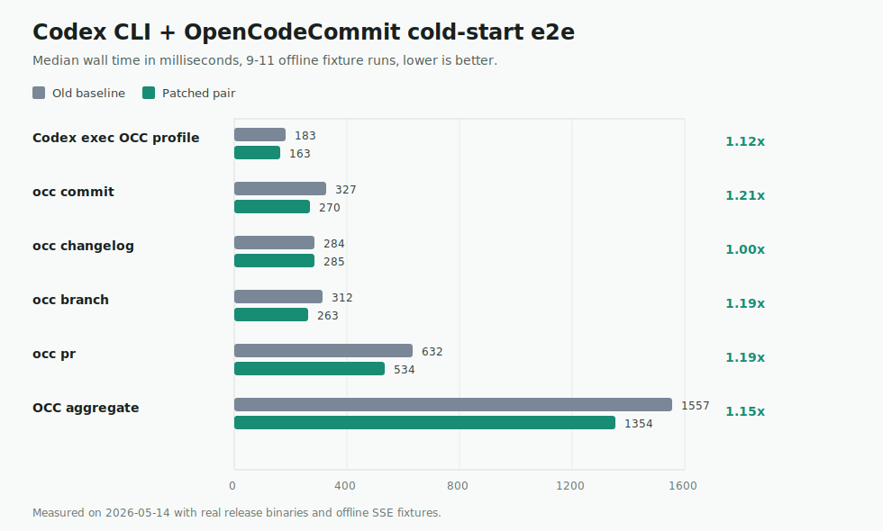

# Codex CLI cold-start comparison

Measured on 2026-05-14 with offline SSE fixtures.

## Codex CLI source build

This is the primary apples-to-apples comparison:

- Baseline: `rust-v0.130.0` / `58573da43`
- Candidate: `239a776ae`
- Toolchain: `rustc 1.93.0`
- Build command for both: `CARGO_PROFILE_RELEASE_LTO=false CARGO_PROFILE_RELEASE_CODEGEN_UNITS=16 cargo +1.93.0 build --release -p codex-cli`
- Binary shape for both: Linux x86_64 GNU dynamic PIE, stripped, 251 MiB
- Workload: offline SSE fixture, fresh `CODEX_HOME` and cwd per sample
- Machine memory during latest run: 62 GiB RAM, 32 GiB `/tmp`, no swap use observed
- Samples: 15 per variant, median reported

| Codex CLI case | Baseline wall | Candidate wall | Wall speedup | Baseline CPU | Candidate CPU | Baseline RSS | Candidate RSS | RSS delta |
| --- | ---: | ---: | ---: | ---: | ---: | ---: | ---: | ---: |
| `codex --help` | 10 ms | 10 ms | 1.00x | 10 ms | 0 ms | 25.6 MiB | 25.5 MiB | -0.1 MiB |
| `codex exec --ephemeral` default tools | 170 ms | 150 ms | 1.13x | 110 ms | 80 ms | 94.5 MiB | 86.8 MiB | -7.7 MiB |
| `codex exec --ephemeral` with plugins/apps/MCP disabled | 170 ms | 150 ms | 1.13x | 90 ms | 70 ms | 92.6 MiB | 84.8 MiB | -7.8 MiB |
| `codex exec --ephemeral` with plugins/apps/MCP/shell disabled | 180 ms | 160 ms | 1.13x | 90 ms | 70 ms | 92.8 MiB | 83.6 MiB | -9.2 MiB |
| persistent `codex exec` with plugins/apps/MCP/shell disabled | 180 ms | 170 ms | 1.06x | 110 ms | 90 ms | 96.2 MiB | 92.3 MiB | -3.9 MiB |

## OpenCodeCommit downstream validation

These tests create temporary repositories and run full `occ` commands against the upstream Codex 0.130.0 native binary and the patched Codex 0.130.0 binary. They validate that the direct Codex CLI startup wins translate into OpenCodeCommit artifact flows.



| Flow | Old baseline median | Patched median | Speedup |
| --- | ---: | ---: | ---: |
| Codex exec OCC profile | 183 ms | 163 ms | 1.12x |
| `occ commit` | 327 ms | 270 ms | 1.21x |
| `occ changelog` | 284 ms | 285 ms | 1.00x |
| `occ branch` | 312 ms | 263 ms | 1.19x |
| `occ pr` | 632 ms | 534 ms | 1.18x |
| OCC aggregate | 1557 ms | 1354 ms | 1.15x |

## Commands

```sh
CODEX_CLI_PERF_BASELINE="$official" \
CODEX_CLI_PERF_CANDIDATE="$candidate" \
CODEX_CLI_PERF_RUNS=11 \
cargo +1.93.0 test -p codex-cli --test cold_start_perf -- --nocapture
```

```sh
OCC_CODEX_PERF_BASELINE_PATH="$official" \
OCC_CODEX_PERF_CANDIDATE_PATH="$candidate" \
OCC_CODEX_PERF_OCC_PATH=/home/antti/code/public/opencodecommit/target/release/occ \
OCC_CODEX_PERF_RUNS=9 \
cargo test -p opencodecommit --test e2e_codex_perf -- --nocapture
```

## Notes

The OCC profile disables Codex plugins, apps, MCP servers, web search for cheap artifact flows, and the model-visible shell tool. In patched Codex, non-interactive `codex exec` also skips shell snapshot startup when the shell tool is disabled.
